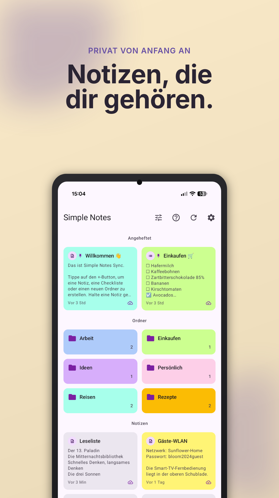
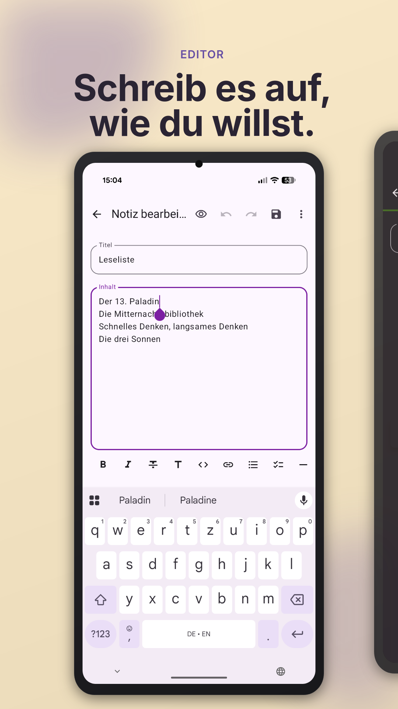
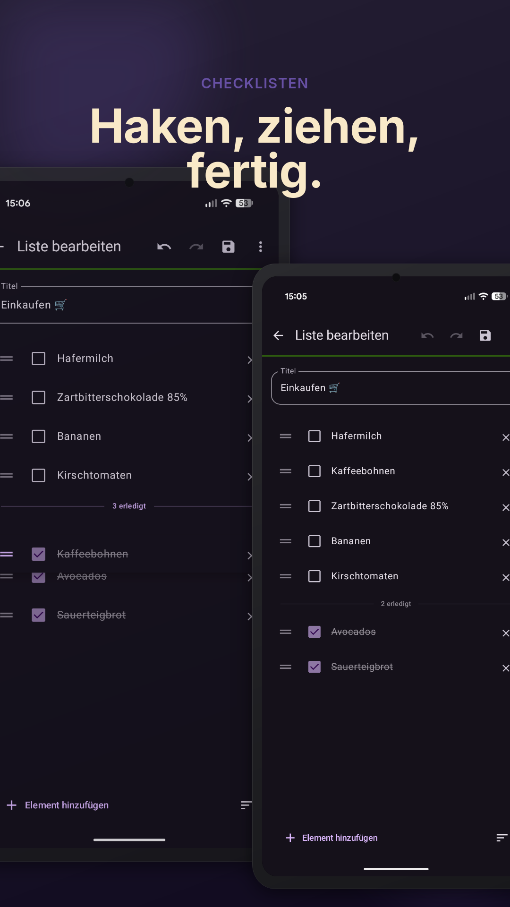
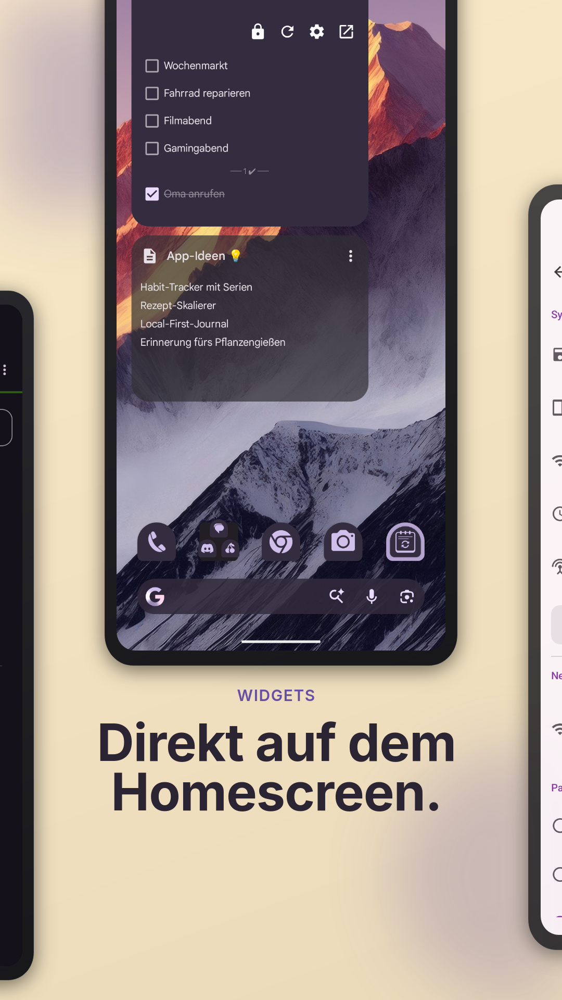
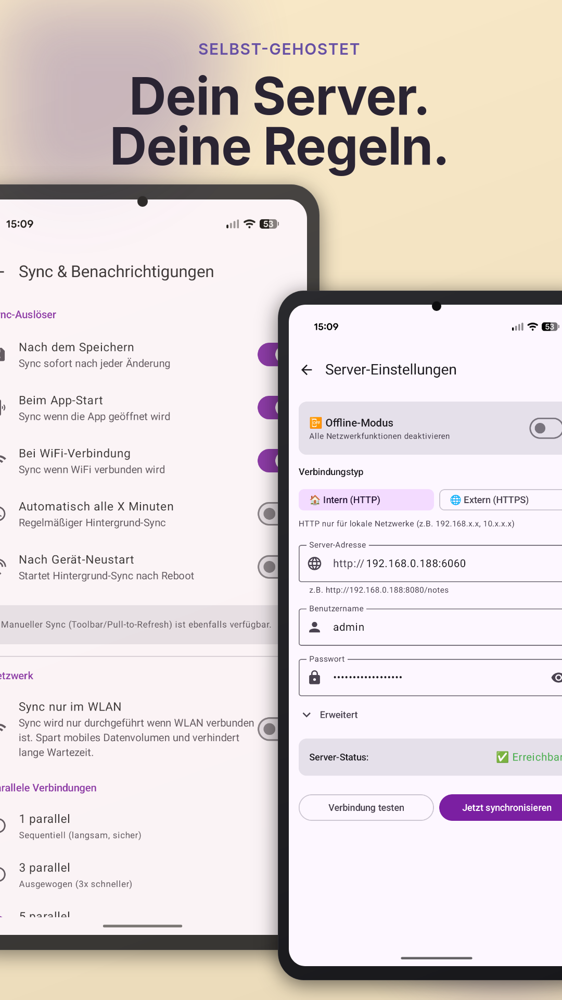
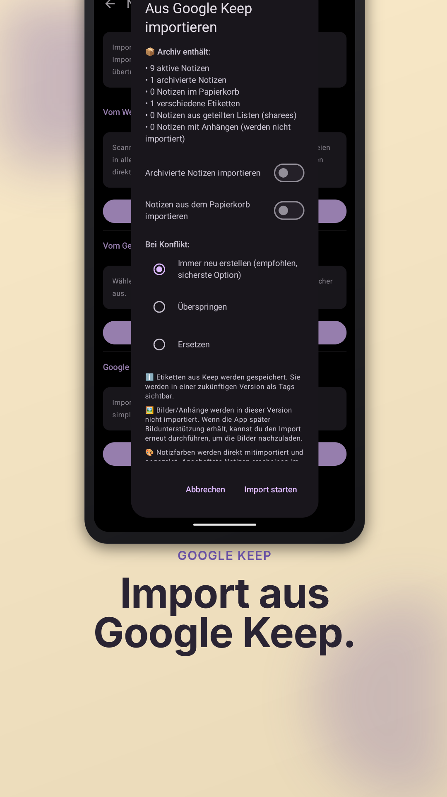

<div align="center">

</div>

<h1 align="center">Simple Notes Sync</h1>

<h4 align="center">Minimalistische Offline-Notizen mit intelligentem Sync - Einfachheit trifft smarte Synchronisation.</h4>

<div align="center">
  
[](https://www.android.com/)
[](https://kotlinlang.org/)
[](https://developer.android.com/compose/)
[](https://m3.material.io/)
[](LICENSE)
[](https://liberapay.com/inventory/)

</div>

<div align="center">

<a href="https://apt.izzysoft.de/fdroid/index/apk/dev.dettmer.simplenotes">
</a>

<a href="https://apps.obtainium.imranr.dev/redirect.html?r=obtainium://add/https://github.com/inventory69/simple-notes-sync">

</a>

<a href="https://f-droid.org/packages/dev.dettmer.simplenotes">
</a>

</div>

<div align="center">
<strong>SHA-256 Hash des Signaturzertifikats:</strong><br /> 42:A1:C6:13:BB:C6:73:04:5A:F3:DC:81:91:BF:9C:B6:45:6E:E4:4C:7D:CE:40:C7:CF:B5:66:FA:CB:69:F1:6A
</div>

<div align="center">

<br />[📱 APK Download](https://github.com/inventory69/simple-notes-sync/releases/latest) · [📖 Dokumentation](docs/DOCS.de.md) · [🚀 Schnellstart](QUICKSTART.de.md)<br />
**🌍** Deutsch · [English](README.md)

</div>

## 📱 Screenshots

<p align="center">
  
  
  
  
  
  
</p>

<div align="center">

  📝 Offline-first &nbsp;•&nbsp; 🔄 Smart Sync &nbsp;•&nbsp; 🔒 Self-hosted &nbsp;•&nbsp; 🔋 Akkuschonend

</div>

## ✨ Highlights

- 📝 **Offline-first** – Funktioniert ohne Internet
- 📊 **Flexible Ansichten** – Listen- und Grid-Layout, 1–5 Spalten konfigurierbar
- ✅ **Checklisten** – Tap-to-Check, Drag & Drop
- 🔄 **Konfigurierbare Sync-Trigger** – onSave, onResume, WiFi, periodisch (15/30/60 Min), Boot
- 📌 **Widgets** – Home-Screen Quick-Note und Notizlisten-Widget
- 🔀 **Smartes Sortieren** – Nach Titel, Änderungsdatum, Erstelldatum, Typ
- ⚡ **Paralleler Sync** – Lädt bis zu 5 Notizen gleichzeitig herunter
- 🌍 **Mehrsprachig** – Deutsch/Englisch mit Sprachauswahl
- 🔒 **Self-hosted** – Deine Daten bleiben bei dir (WebDAV)
- 💾 **Lokales Backup** – Export/Import als JSON-Datei (optional verschlüsselt)
- 🖥️ **Desktop-Integration** – Markdown-Export für Obsidian, VS Code, Typora
- 📤 **Teilen & Exportieren** – Als Text oder PDF teilen, in Kalender exportieren
- ↩️ **Rückgängig/Wiederherstellen** – Vollständige Undo/Redo-Historie im Notiz-Editor
- 🎨 **Material Design 3** - 7 Farbschemata inkl. AMOLED & Dynamic Color, animierte Theme-Übergänge

➡️ **Vollständige Feature-Liste:** [docs/FEATURES.de.md](docs/FEATURES.de.md)

## 🚀 Schnellstart

### 1. Server Setup (5 Minuten)

```bash
git clone https://github.com/inventory69/simple-notes-sync.git
cd simple-notes-sync/server
cp .env.example .env
# Passwort in .env setzen
docker compose up -d
```

➡️ **Details:** [Server Setup Guide](server/README.md)

### 2. App Installation (2 Minuten)

1. [APK herunterladen](https://github.com/inventory69/simple-notes-sync/releases/latest)
2. Installieren & öffnen
3. ⚙️ Einstellungen → Server konfigurieren:
  - **URL:** `http://DEINE-SERVER-IP:8080/` _(nur Base-URL!)_
  - **User:** `noteuser`
  - **Passwort:** _(aus .env)_
  - **WLAN:** _(dein Netzwerk-Name)_
4. **Verbindung testen** → Auto-Sync aktivieren
5. Fertig! 🎉

➡️ **Ausführliche Anleitung:** [QUICKSTART.de.md](QUICKSTART.de.md)

## 📚 Dokumentation

| Dokument | Inhalt |
|----------|--------|
| **[QUICKSTART.de.md](QUICKSTART.de.md)** | Schritt-für-Schritt Installation |
| **[FEATURES.de.md](docs/FEATURES.de.md)** | Vollständige Feature-Liste |
| **[BACKUP.de.md](docs/BACKUP.de.md)** | Backup & Wiederherstellung |
| **[DESKTOP.de.md](docs/DESKTOP.de.md)** | Desktop-Integration (Markdown) |
| **[SELF_SIGNED_SSL.md](docs/SELF_SIGNED_SSL.md)** | Self-signed SSL Zertifikat Setup |
| **[DOCS.de.md](docs/DOCS.de.md)** | Technische Details & Troubleshooting |
| **[CHANGELOG.de.md](CHANGELOG.de.md)** | Versionshistorie |
| **[UPCOMING.de.md](docs/UPCOMING.de.md)** | Geplante Features 🚀 |
| **[ÜBERSETZEN.md](docs/TRANSLATING.de.md)** | Übersetzungsanleitung 🌍 |

## 🛠️ Entwicklung

```bash
cd android
./gradlew assembleStandardRelease
```

➡️ **Build-Anleitung:** [docs/DOCS.de.md#-build--deployment](docs/DOCS.de.md#-build--deployment)

## 🌍 Übersetzungen

[](https://hosted.weblate.org/engage/simple-notes-sync/)

<a href="https://hosted.weblate.org/engage/simple-notes-sync/">

</a>

## 🤝 Contributing

Beiträge willkommen! Siehe [CONTRIBUTING.md](CONTRIBUTING.md)

Wenn du die App nützlich findest, kannst du die Entwicklung unterstützen:

<a href="https://liberapay.com/inventory/">

</a>

## 📄 Lizenz

Apache License 2.0 – siehe [LICENSE](LICENSE)

<div align="center">
<br /><br />

**v2.0.0** · Built with ❤️ using Kotlin + Jetpack Compose + Material Design 3

</div>
