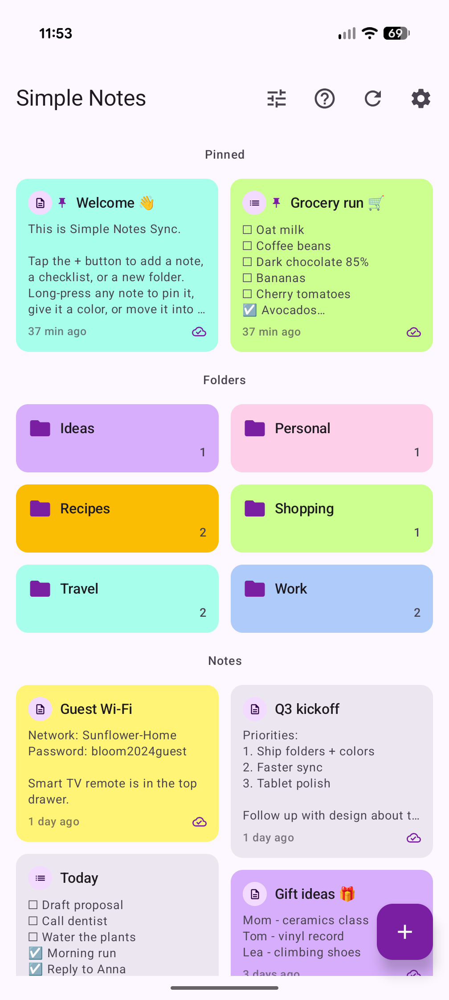
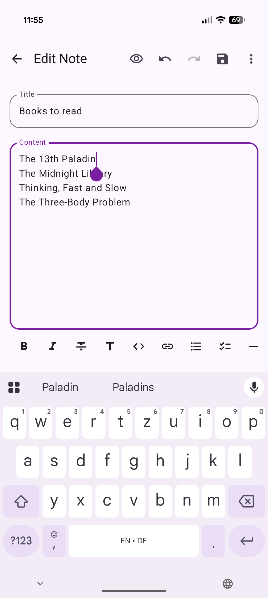
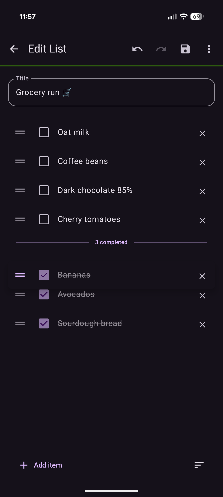
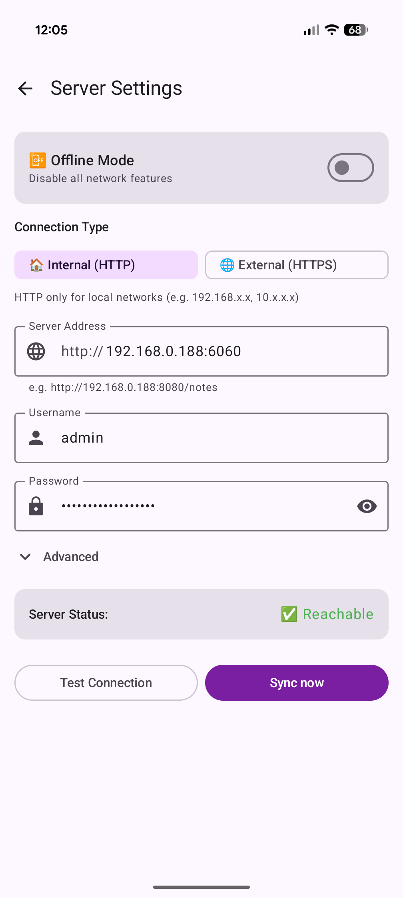
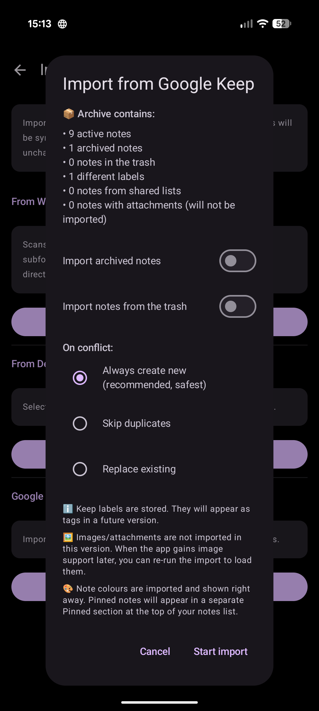
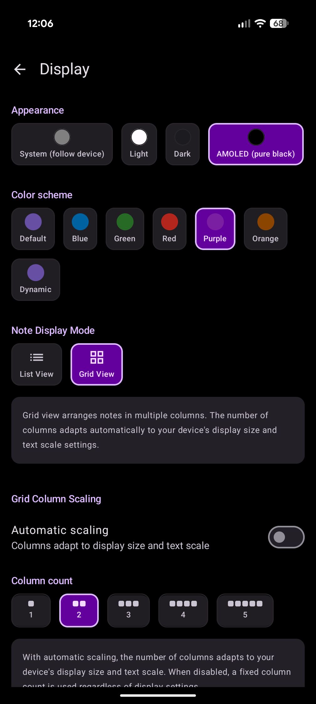

<div align="center">

</div>

<h1 align="center">Simple Notes Sync</h1>

<h4 align="center">Note pulite, offline-first con sincronizzazione intelligente - semplicità e sincronizzazione smart si incontrano.</h4>

<div align="center">
  
[](https://www.android.com/)
[](https://kotlinlang.org/)
[](https://developer.android.com/compose/)
[](https://m3.material.io/)
[](LICENSE)
[](https://liberapay.com/inventory/)

</div>

<div align="center">

<a href="https://apt.izzysoft.de/fdroid/index/apk/dev.dettmer.simplenotes">
</a>

<a href="https://apps.obtainium.imranr.dev/redirect.html?r=obtainium://add/https://github.com/inventory69/simple-notes-sync">

</a>

<a href="https://f-droid.org/packages/dev.dettmer.simplenotes">
</a>

<a href="https://play.google.com/store/apps/details?id=dev.dettmer.simplenotes">
</a>

</div>

<div align="center">
<strong>SHA-256 hash del certificato di firma:</strong><br /> 42:A1:C6:13:BB:C6:73:04:5A:F3:DC:81:91:BF:9C:B6:45:6E:E4:4C:7D:CE:40:C7:CF:B5:66:FA:CB:69:F1:6A
</div>

<div align="center">

<br />[📱 Download APK](https://github.com/inventory69/simple-notes-sync/releases/latest) · [📖 Documentazione](docs/DOCS.md) · [🚀 Avvio rapido](QUICKSTART.md)<br />
**🌍** Italiano · [Deutsch](README.de.md) · [English](README.md)

</div>

## 📱 Screenshot

<p align="center">
  
  
  
  
  
  
</p>

<div align="center">

  📝 Offline-first &nbsp;•&nbsp; 🔄 Sync intelligente &nbsp;•&nbsp; 🔒 Self-hosted &nbsp;•&nbsp; 🔋 Risparmio energetico

</div>

## ✨ Punti salienti

- 📝 **Offline-first** – Funziona senza connessione internet
- 📁 **Cartelle** – Organizza le note in cartelle, con opzione "solo locali" (mai sincronizzate)
- 📌 **Note fissate** – Tieni le note importanti in cima
- 🗑️ **Cestino** – Le note eliminate finiscono nel cestino con conservazione configurabile (0–90 giorni)
- 🗄️ **Archivio** – Togli le note di mezzo senza eliminarle; ripristinabili in qualsiasi momento
- ✅ **Checklist** – Spunta al tocco, drag & drop, conversione testo ↔ checklist
- ✍️ **Markdown dal vivo** – Evidenziazione istantanea nell'editor e anteprime renderizzate in lista/griglia
- 📋 **Incolla formattato** – Il contenuto HTML incollato da Telegram, Word, Google Docs e browser viene convertito in Markdown
- 🎨 **Colori delle note** – Codifica a colori, quindi filtra e ordina per colore
- 📥 **Import da Google Keep** – Porta le tue note da un export di Keep
- 📊 **Viste flessibili** – Layout a lista o griglia, da 1 a 5 colonne, dimensione del testo regolabile, sezioni comprimibili e riordinabili
- 🧩 **Widget** – Widget per singola nota, elenco note scorrevole e creazione rapida di nuove note
- 🔄 **Trigger di sync configurabili** – Al salvataggio, in rientro nell'app, connessione WiFi, periodico (15/30/60 min), all'avvio
- ⚡ **Sync parallelo** – Carica/scarica fino a 5 note contemporaneamente
- 🔒 **Self-hosted** – I tuoi dati restano tuoi (WebDAV, credenziali crittografate)
- 🔐 **Blocco app** – Sblocco opzionale biometrico/PIN con protezione dagli screenshot
- 💾 **Backup locale** – Esportazione/importazione come file JSON
- 🖥️ **Integrazione desktop** – Export Markdown per Obsidian, VS Code, Typora
- 💻 **Editor desktop** _(beta)_ – Modifica le tue note su Windows & Linux con [Simple Notes Desktop](https://github.com/inventory69/simple-notes-desktop), l'app companion sincronizzata via WebDAV
- 📤 **Condivisione ed esportazione** – Ricevi testo condiviso, condividi come testo o PDF, esporta nel calendario
- ↩️ **Annulla/Ripeti** – Cronologia completa di undo/redo nell'editor delle note
- 🌍 **Multilingue** – 12 lingue con selettore lingua integrato nell'app
- 🎨 **Material Design 3** – 7 schemi colore inclusi AMOLED e Dynamic Color, transizioni di tema animate

➡️ **Elenco completo delle funzionalità:** [docs/FEATURES.md](docs/FEATURES.md)

## 🚀 Avvio rapido

### 1. Configurazione del server (5 minuti)

```bash
git clone https://github.com/inventory69/simple-notes-sync.git
cd simple-notes-sync/server
cp .env.example .env
# Imposta la password in .env
docker compose up -d
```

➡️ **Dettagli:** [Guida alla configurazione del server](server/README.md)

### 2. Installazione dell'app (2 minuti)

1. [Scarica l'APK](https://github.com/inventory69/simple-notes-sync/releases/latest)
2. Installa e apri
3. ⚙️ Impostazioni → Configura il server:
   - **URL:** `http://TUO-IP-SERVER:8080/` _(solo URL di base!)_
   - **Utente:** `noteuser`
   - **Password:** _(da .env)_
   - **WiFi:** _(il nome della tua rete)_
4. **Testa la connessione** → Attiva la sincronizzazione automatica
5. Fatto! 🎉

➡️ **Guida dettagliata:** [QUICKSTART.md](QUICKSTART.md)

## 📚 Documentazione

| Documento | Contenuto |
|----------|--------|
| **[QUICKSTART.md](QUICKSTART.md)** | Installazione passo passo |
| **[FEATURES.md](docs/FEATURES.md)** | Elenco completo delle funzionalità |
| **[BACKUP.md](docs/BACKUP.md)** | Guida al backup e ripristino |
| **[DESKTOP.md](docs/DESKTOP.md)** | Integrazione desktop (Markdown) |
| **[Simple Notes Desktop](https://github.com/inventory69/simple-notes-desktop)** | Editor desktop per Windows & Linux _(beta)_ 💻 |
| **[SELF_SIGNED_SSL.md](docs/SELF_SIGNED_SSL.md)** | Configurazione certificato SSL self-signed |
| **[DOCS.md](docs/DOCS.md)** | Dettagli tecnici e risoluzione dei problemi |
| **[CHANGELOG.md](CHANGELOG.md)** | Cronologia versioni |
| **[UPCOMING.md](docs/UPCOMING.md)** | Funzionalità in arrivo 🚀 |
| **[TRANSLATING.md](docs/TRANSLATING.md)** | Guida alla traduzione 🌍 |

## 🛠️ Sviluppo

```bash
cd android
./gradlew assembleStandardRelease
```

➡️ **Guida alla build:** [docs/DOCS.md#-build--deployment](docs/DOCS.md#-build--deployment)

## 💡 Richieste di funzionalità e idee

Hai un'idea per una nuova funzionalità o un miglioramento? Ci piacerebbe sentirla!

➡️ **Come suggerire funzionalità:**

1. Controlla le [discussioni esistenti](https://github.com/inventory69/simple-notes-sync/discussions) per vedere se qualcuno l'ha già proposta
2. In caso contrario, apri una nuova discussione nella categoria "Feature Requests / Ideas"
3. Metti un voto (👍) alle funzionalità che vorresti vedere

Le funzionalità con abbastanza supporto della community verranno prese in considerazione. Tieni presente che quest'app è progettata per rimanere semplice e intuitiva.

## 🌍 Traduzioni

L'hosting delle traduzioni è fornito gentilmente da [Weblate](https://hosted.weblate.org/projects/simple-notes-sync/) - grazie per sponsorizzare i progetti open source! 🙏

[](https://hosted.weblate.org/engage/simple-notes-sync/)

<a href="https://hosted.weblate.org/engage/simple-notes-sync/">

</a>

## 🤝 Contribuire

I contributi sono benvenuti! Vedi [CONTRIBUTING.md](CONTRIBUTING.md)

Se trovi utile questa app, puoi supportarne lo sviluppo:

<a href="https://liberapay.com/inventory/">

</a>

## 📄 Licenza

GNU Affero General Public License v3.0 – vedi [LICENSE](LICENSE)

<div align="center">
<br /><br />

**v2.19.0** · Creato con ❤️ usando Kotlin + Jetpack Compose + Material Design 3

</div>