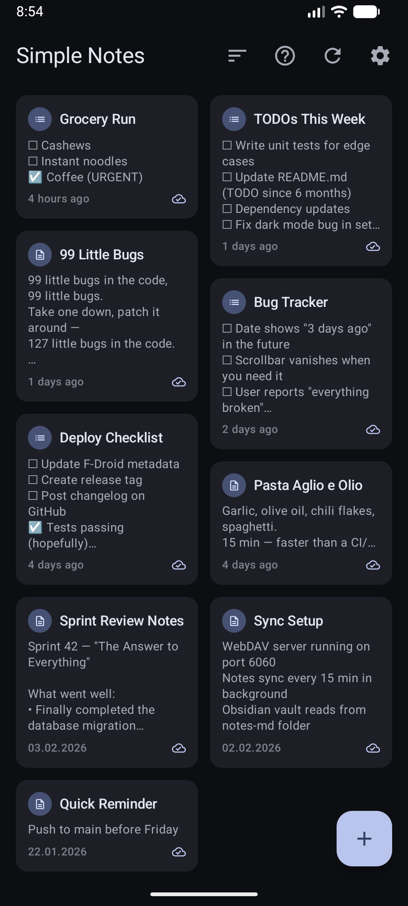
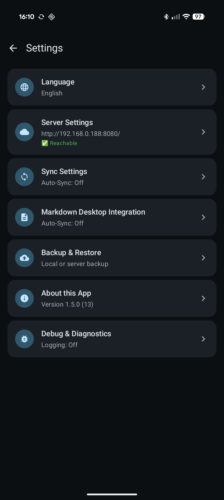
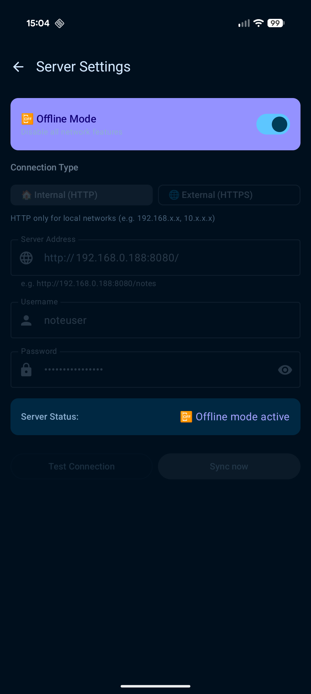
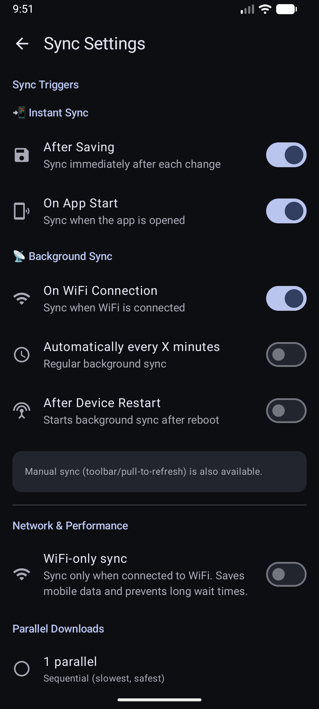

# Simple Notes Sync 📝

> Minimalist offline notes with auto-sync to your own server

[](https://www.android.com/)
[](https://m3.material.io/)
[](LICENSE)

[](https://apt.izzysoft.de/fdroid/index/apk/dev.dettmer.simplenotes)
[](https://f-droid.org/packages/dev.dettmer.simplenotes/)

**📱 [APK Download](https://github.com/inventory69/simple-notes-sync/releases/latest)** · **📖 [Documentation](docs/DOCS.md)** · **🚀 [Quick Start](QUICKSTART.md)**

**🌍 Languages:** [Deutsch](README.de.md) · **English**

---

## 📱 Screenshots

<p align="center">
  
  
  
  
  
  
</p>

---

## ✨ Highlights

- ✅ **NEW: Checklists** - Tap-to-check, drag & drop
- 🌍 **NEW: Multilingual** - English/German with language selector
- 📝 **Offline-first** - Works without internet
- 🔄 **Configurable sync triggers** - onSave, onResume, WiFi-connect, periodic (15/30/60 min), boot
- 🔒 **Self-hosted** - Your data stays with you (WebDAV)
- 💾 **Local backup** - Export/Import as JSON file
- 🖥️ **Desktop integration** - Markdown export for Obsidian, VS Code, Typora
- 🔋 **Battery-friendly** - ~0.2% with defaults, up to ~1.0% with periodic sync
- 🎨 **Material Design 3** - Dark mode & dynamic colors

➡️ **Complete feature list:** [FEATURES.md](docs/FEATURES.md)

---

## 🚀 Quick Start

### 1. Server Setup (5 minutes)

```bash
git clone https://github.com/inventory69/simple-notes-sync.git
cd simple-notes-sync/server
cp .env.example .env
# Set password in .env
docker compose up -d
```

➡️ **Details:** [Server Setup Guide](server/README.md)

### 2. App Installation (2 minutes)

1. [Download APK](https://github.com/inventory69/simple-notes-sync/releases/latest)
2. Install & open
3. ⚙️ Settings → Configure server:
   - **URL:** `http://YOUR-SERVER-IP:8080/` _(base URL only!)_
   - **User:** `noteuser`
   - **Password:** _(from .env)_
   - **WiFi:** _(your network name)_
4. **Test connection** → Enable auto-sync
5. Done! 🎉

➡️ **Detailed guide:** [QUICKSTART.md](QUICKSTART.md)

---

## 📚 Documentation

| Document | Content |
|----------|---------|
| **[QUICKSTART.md](QUICKSTART.md)** | Step-by-step installation |
| **[FEATURES.md](docs/FEATURES.md)** | Complete feature list |
| **[BACKUP.md](docs/BACKUP.md)** | Backup & restore guide |
| **[DESKTOP.md](docs/DESKTOP.md)** | Desktop integration (Markdown) |
| **[DOCS.md](docs/DOCS.md)** | Technical details & troubleshooting |
| **[CHANGELOG.md](CHANGELOG.md)** | Version history |
| **[UPCOMING.md](docs/UPCOMING.md)** | Upcoming features 🚀 |
| **[TRANSLATING.md](docs/TRANSLATING.md)** | Translation guide 🌍 |

```bash
cd android
./gradlew assembleStandardRelease
```

➡️ **Build guide:** [DOCS.md](docs/DOCS.md#-build--deployment)

---

## 🤝 Contributing

Contributions welcome! See [CONTRIBUTING.md](CONTRIBUTING.md)

---

## 📄 License

MIT License - see [LICENSE](LICENSE)

---

**v1.6.0** · Built with ❤️ using Kotlin + Jetpack Compose + Material Design 3
