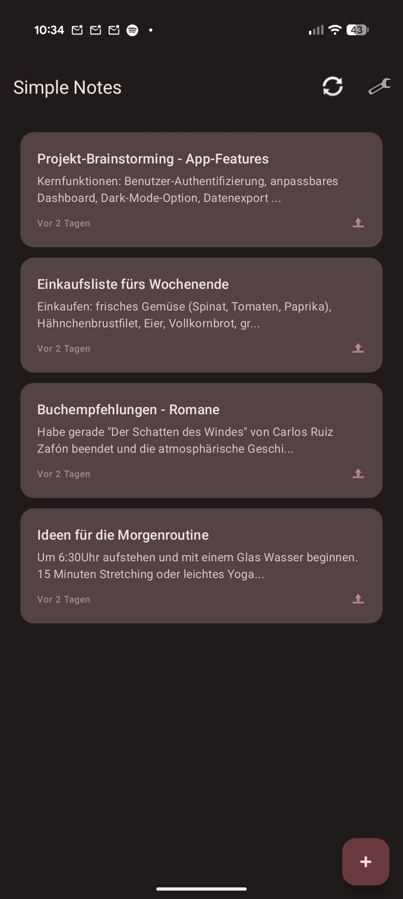
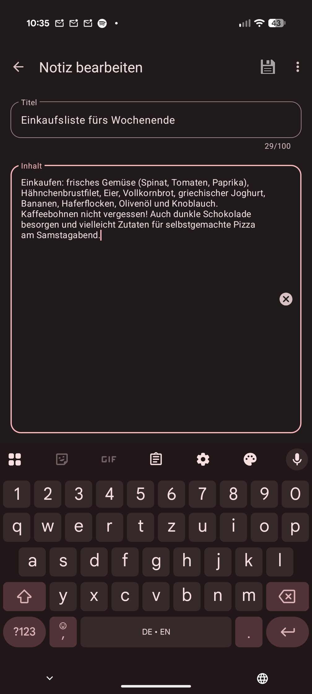
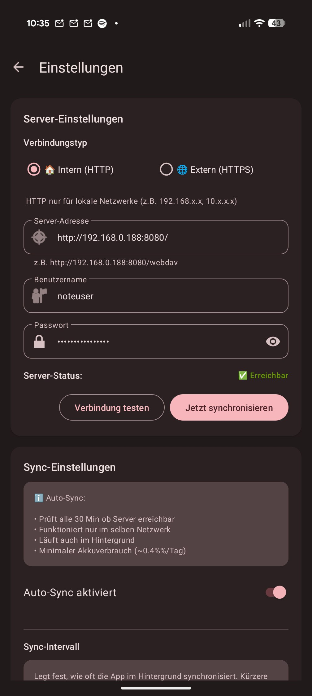

# Simple Notes Sync 📝

> Minimalistische Offline-Notizen mit Auto-Sync zu deinem eigenen Server

[](https://www.android.com/)
[](https://m3.material.io/)
[](LICENSE)

**📱 [APK Download](https://github.com/inventory69/simple-notes-sync/releases/latest)** · **📖 [Dokumentation](docs/DOCS.md)** · **🚀 [Quick Start](QUICKSTART.md)**

**🌍 Sprachen:** **Deutsch** · [English](README.en.md)

---

## 📱 Screenshots

<p align="center">
  
  
  
</p>

---

## ✨ Highlights

- 📝 **Offline-First** - Funktioniert ohne Internet
- 🔄 **Auto-Sync** - Nur im Heim-WLAN (15/30/60 Min)
- 🔒 **Self-Hosted** - Deine Daten bleiben bei dir (WebDAV)
- 💾 **Lokales Backup** - Export/Import als JSON-Datei
- 🖥️ **Desktop-Integration** - Markdown-Export für VS Code, Typora, etc.
- 🔋 **Akkuschonend** - ~0.2-0.8% pro Tag
- 🎨 **Material Design 3** - Dark Mode & Dynamic Colors

➡️ **Vollständige Feature-Liste:** [FEATURES.md](docs/FEATURES.md)

---

## 🚀 Schnellstart

### 1. Server Setup (5 Minuten)

```bash
git clone https://github.com/inventory69/simple-notes-sync.git
cd simple-notes-sync/server
cp .env.example .env
# Passwort in .env setzen
docker compose up -d
```

➡️ **Details:** [Server Setup Guide](server/README.md)

### 2. App Installation (2 Minuten)

1. [APK herunterladen](https://github.com/inventory69/simple-notes-sync/releases/latest)
2. Installieren & öffnen
3. ⚙️ Einstellungen → Server konfigurieren:
   - **URL:** `http://DEINE-SERVER-IP:8080/` _(nur Base-URL!)_
   - **User:** `noteuser`
   - **Passwort:** _(aus .env)_
   - **WLAN:** _(dein Netzwerk-Name)_
4. **Verbindung testen** → Auto-Sync aktivieren
5. Fertig! 🎉

➡️ **Ausführliche Anleitung:** [QUICKSTART.md](QUICKSTART.md)

---

## 📚 Dokumentation

| Dokument | Inhalt |
|----------|--------|
| **[QUICKSTART.md](QUICKSTART.md)** | Schritt-für-Schritt Installation |
| **[FEATURES.md](docs/FEATURES.md)** | Vollständige Feature-Liste |
| **[BACKUP.md](docs/BACKUP.md)** | Backup & Wiederherstellung |
| **[DESKTOP.md](docs/DESKTOP.md)** | Desktop-Integration (Markdown) |
| **[DOCS.md](docs/DOCS.md)** | Technische Details & Troubleshooting |
| **[CHANGELOG.md](CHANGELOG.md)** | Versionshistorie |

---

## 🛠️ Entwicklung

```bash
cd android
./gradlew assembleStandardRelease
```

➡️ **Build-Anleitung:** [DOCS.md](docs/DOCS.md)

---

## 🤝 Contributing

Beiträge willkommen! Siehe [CONTRIBUTING.md](CONTRIBUTING.md)

---

## 📄 Lizenz

MIT License - siehe [LICENSE](LICENSE)

---

**v1.2.1** · Built with ❤️ using Kotlin + Material Design 3
