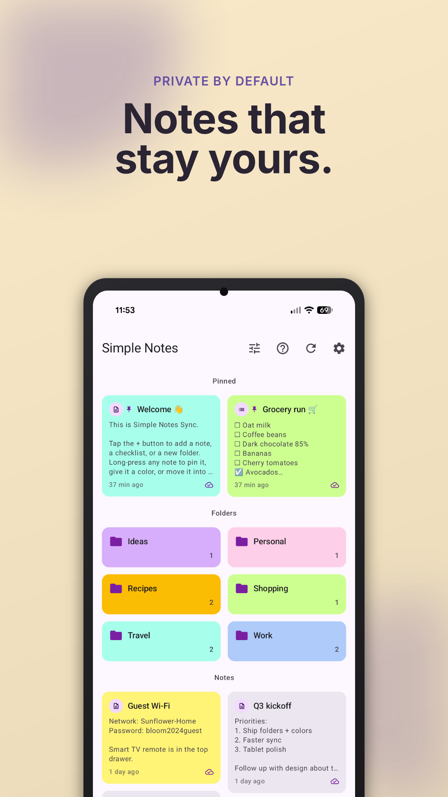
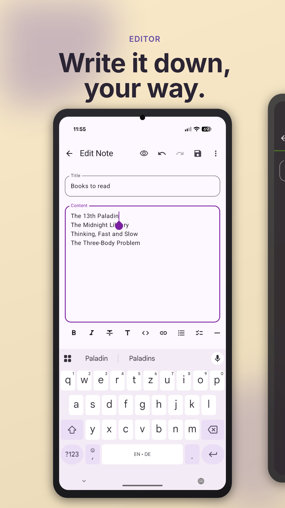
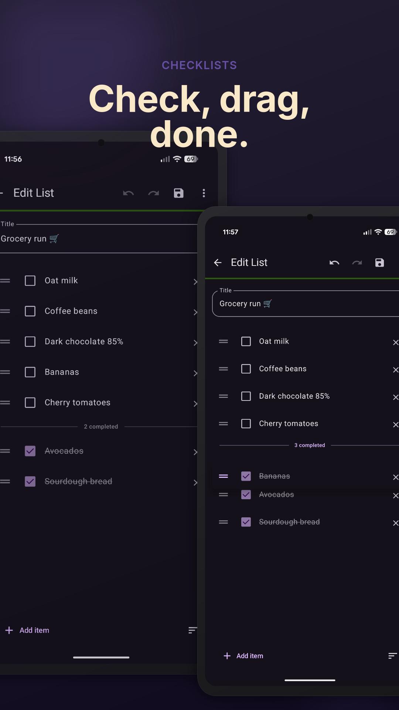
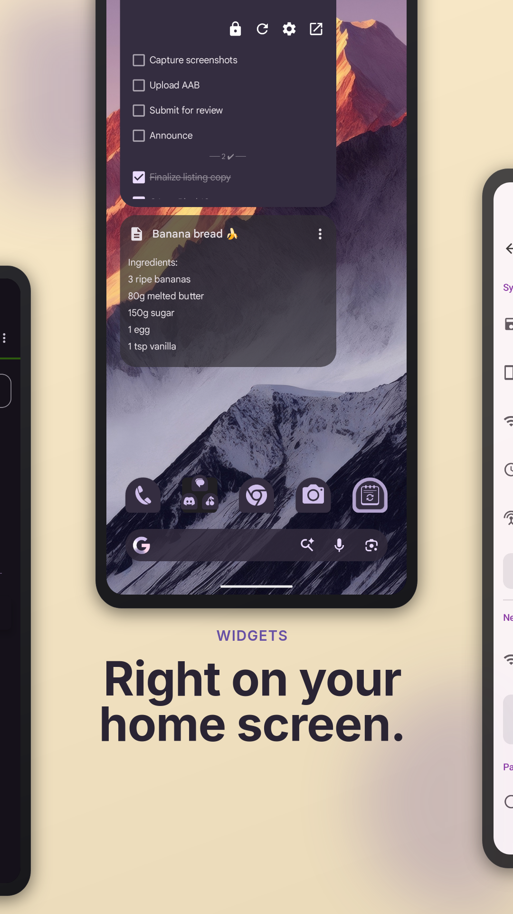
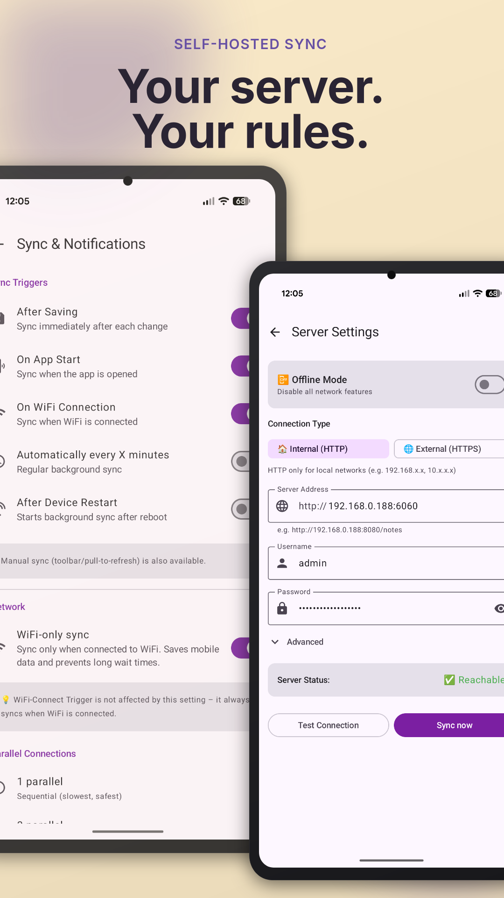
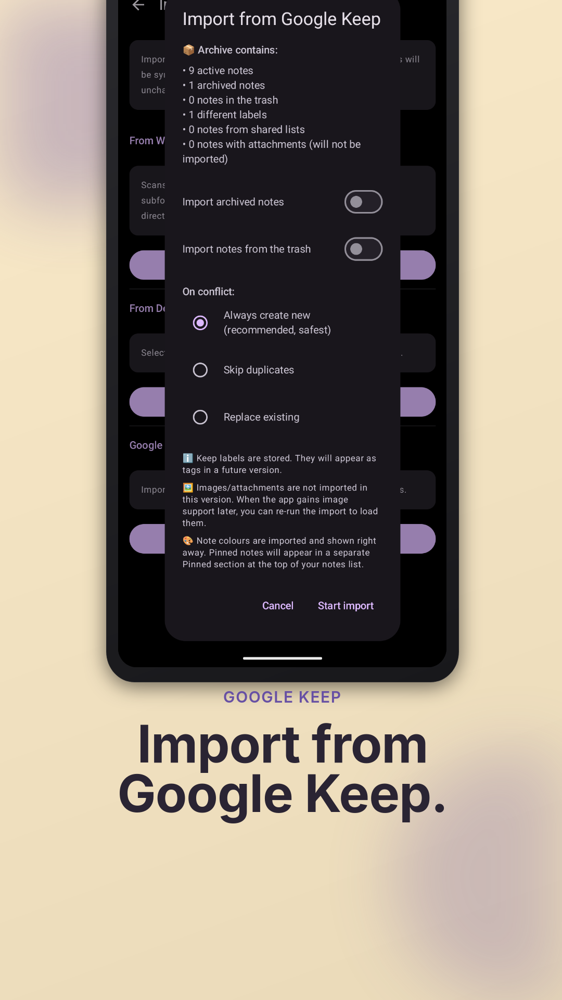

<div align="center">

</div>

<h1 align="center">Simple Notes Sync</h1>

<h4 align="center">Clean, offline-first notes with intelligent sync - simplicity meets smart synchronization.</h4>

<div align="center">
  
[](https://www.android.com/)
[](https://kotlinlang.org/)
[](https://developer.android.com/compose/)
[](https://m3.material.io/)
[](LICENSE)
[](https://liberapay.com/inventory/)

</div>

<div align="center">

<a href="https://apt.izzysoft.de/fdroid/index/apk/dev.dettmer.simplenotes">
</a>

<a href="https://apps.obtainium.imranr.dev/redirect.html?r=obtainium://add/https://github.com/inventory69/simple-notes-sync">

</a>

<a href="https://f-droid.org/packages/dev.dettmer.simplenotes">
</a>
  
</div>

<div align="center">
<strong>SHA-256 hash of the signing certificate:</strong><br />42:A1:C6:13:BB:C6:73:04:5A:F3:DC:81:91:BF:9C:B6:45:6E:E4:4C:7D:CE:40:C7:CF:B5:66:FA:CB:69:F1:6A
</div>

<div align="center">

<br />[📱 APK Download](https://github.com/inventory69/simple-notes-sync/releases/latest) · [📖 Documentation](docs/DOCS.md) · [🚀 Quick Start](QUICKSTART.md)<br />
**🌍** [Deutsch](README.de.md) · **English**

</div>

## 📱 Screenshots

<p align="center">
  
  
  
  
  
  
</p>

<div align="center">

  📝 Offline-first &nbsp;•&nbsp; 🔄 Smart Sync &nbsp;•&nbsp; 🔒 Self-hosted &nbsp;•&nbsp; 🔋 Battery-friendly

</div>

## ✨ Highlights

- 📝 **Offline-first** - Works without internet
- 📊 **Flexible views** - Switch between list and grid layout, 1–5 column scaling
- ✅ **Checklists** - Tap-to-check, drag & drop
- 🔄 **Configurable sync triggers** - onSave, onResume, WiFi-connect, periodic (15/30/60 min), boot
- 📌 **Widgets** - Home screen quick-note and note list widgets
- 🔀 **Smart sorting** - By title, date modified, date created, type
- ⚡ **Parallel sync** - Downloads up to 5 notes simultaneously
- 🌍 **Multilingual** - English/German with language selector
- 🔒 **Self-hosted** - Your data stays with you (WebDAV)
- 💾 **Local backup** - Export/Import as JSON file (encryption available)
- 🖥️ **Desktop integration** - Markdown export for Obsidian, VS Code, Typora
- 📤 **Share & export** - Share as text or PDF, export to calendar
- ↩️ **Undo/Redo** - Full undo/redo history in the note editor
- 🎨 **Material Design 3** - 7 color schemes incl. AMOLED & Dynamic Color, animated theme transitions

➡️ **Complete feature list:** [FEATURES.md](docs/FEATURES.md)

## 🚀 Quick Start

### 1. Server Setup (5 minutes)

```bash
git clone https://github.com/inventory69/simple-notes-sync.git
cd simple-notes-sync/server
cp .env.example .env
# Set password in .env
docker compose up -d
```

➡️ **Details:** [Server Setup Guide](server/README.md)

### 2. App Installation (2 minutes)

1. [Download APK](https://github.com/inventory69/simple-notes-sync/releases/latest)
2. Install & open
3. ⚙️ Settings → Configure server:
   - **URL:** `http://YOUR-SERVER-IP:8080/` _(base URL only!)_
   - **User:** `noteuser`
   - **Password:** _(from .env)_
   - **WiFi:** _(your network name)_
4. **Test connection** → Enable auto-sync
5. Done! 🎉

➡️ **Detailed guide:** [QUICKSTART.md](QUICKSTART.md)

## 📚 Documentation

| Document | Content |
|----------|---------|
| **[QUICKSTART.md](QUICKSTART.md)** | Step-by-step installation |
| **[FEATURES.md](docs/FEATURES.md)** | Complete feature list |
| **[BACKUP.md](docs/BACKUP.md)** | Backup & restore guide |
| **[DESKTOP.md](docs/DESKTOP.md)** | Desktop integration (Markdown) |
| **[SELF_SIGNED_SSL.md](docs/SELF_SIGNED_SSL.md)** | Self-signed SSL certificate setup |
| **[DOCS.md](docs/DOCS.md)** | Technical details & troubleshooting |
| **[CHANGELOG.md](CHANGELOG.md)** | Version history |
| **[UPCOMING.md](docs/UPCOMING.md)** | Upcoming features 🚀 |
| **[TRANSLATING.md](docs/TRANSLATING.md)** | Translation guide 🌍 |

```bash
cd android
./gradlew assembleStandardRelease
```

➡️ **Build guide:** [DOCS.md](docs/DOCS.md#-build--deployment)

## 💡 Feature Requests & Ideas

Have an idea for a new feature or improvement? We'd love to hear it!

➡️ **How to suggest features:**

1. Check [existing discussions](https://github.com/inventory69/simple-notes-sync/discussions) to see if someone already suggested it
2. If not, start a new discussion in the "Feature Requests / Ideas" category
3. Upvote (👍) features you'd like to see

Features with enough community support will be considered for implementation. Please keep in mind that this app is designed to stay simple and user-friendly.

## 🌍 Translations

[](https://hosted.weblate.org/engage/simple-notes-sync/)

<a href="https://hosted.weblate.org/engage/simple-notes-sync/">

</a>

## 🤝 Contributing

Contributions welcome! See [CONTRIBUTING.md](CONTRIBUTING.md)

If you find this app useful, you can support its development:

<a href="https://liberapay.com/inventory/">

</a>

## 📄 License

GNU Affero General Public License v3.0 - see [LICENSE](LICENSE)

<div align="center">
<br /><br />

**v2.1.0** · Built with ❤️ using Kotlin + Jetpack Compose + Material Design 3

</div>
